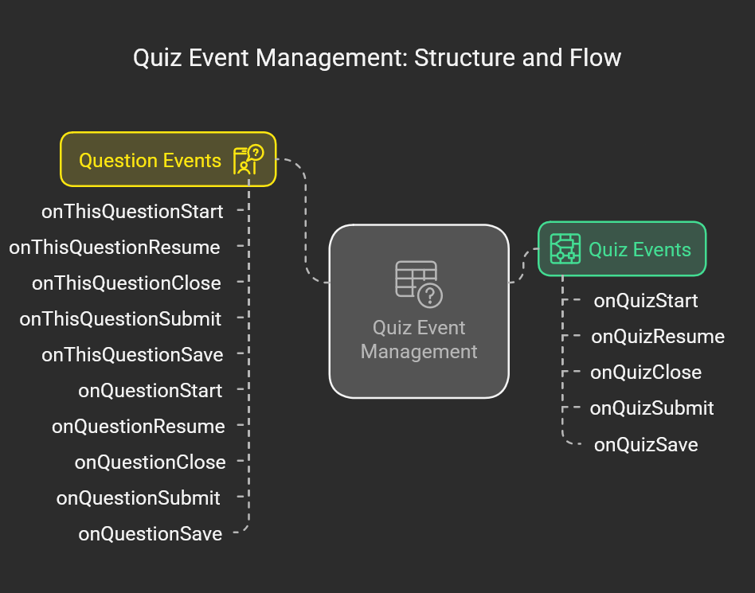

# Overview

The event system is based on a mix of the strategy, factory and hollywood design patterns.

## How does event calling work

Events are called whenever a user interacts with the system. For example, the user clicks on the save button a onQuestionSave event is triggered on every question and a onThisQuestionSave event is triggered on the question which was save.

This approach allows for dynamic modules to be created which can wait on specific events getting triggered and act on them accordingly.

### High level overview of events

