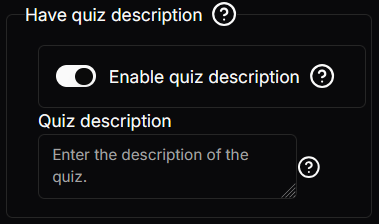
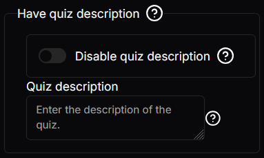

# Conditional Toggle Setting
This setting is used when you would like to have the `children` only display when the `condition` is met.

## Json configuration

```json
{
  "type": "ConditionalBool",
  "label": "Have quiz description",
  "tooltip": "Enable to allow the quiz to have a description",
  "required": true,
  "disabled": false,
  "not": false,
  "condition": {
    "type": "Toggle",
    "tooltip": "Having a description on the quiz",
    "label": "Enable quiz description",
    "required": true,
    "disabled": false,
    "value": false,
    "display": "Switch"
  },
  "children": {
    "type": "Input",
    "label": "Quiz description",
    "tooltip": "Enter the description of the quiz.",
    "required": true,
    "disabled": false,
    "value": "",
    "maxCharacters": null,
    "maxLines": null
  }
}
```
#### condition
The `condition` is a [toggle setting](./toggle-setting.md). When it evaluates to `true` the `children` are displayed. If `not` is `true` then it would be when the `condition` evaluates to `false` that the `children` are displayed.

#### children
This is what is displayed upon `condition` evaluates to `true`. If `not` is `true` then it would be displayed when the `condition` evaluates to `false`.

The `children` are any singular setting which inherits the `BaseSetting`, therefore it would be any setting described in this documentation.

#### not
This is a boolean value which, when true inverts the `condition` to display the `children`. 

## Visual Look
### Conditional Toggle




### Inverted Conditional Toggle
This is when `not` is set to `true`.

