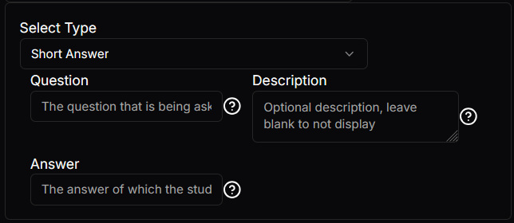

# Conditional Select Setting
This is a select where when the option is selected the associated child appears. I.e: if we have a select box with two options and option one is selected. The `BaseSetting` that is connected to that option will appear. Then if the user then selects the second option instead the second options `BaseSetting` will appear.

## Json configuration
The `condition` is the [select setting](select-setting.md). When one of the `availableValues` from the `condition` are selected the corresponding `group` is shown. 

The `group` is a map of `availableValues` to its associated `BaseSetting` and since all the settings described here inherit `BaseSetting` any can be used.


This example is a small snapshot of how the [Basic Question Module](/docs/category/basicquestion) does its selection. The full settings for [Basic Question Module](/docs/category/basicquestion) has all of the options, this example here is to show how it would work with just `Short Answer` and `Long Answer`.
```json
{
  "type": "ConditionalSelect",
  "label": null,
  "required": true,
  "disabled": false,
  "condition": {
    "type": "Select",
    "label": "Select Type",
    "required": true,
    "disabled": false,
    "value": null,
    "availableValues": [
      "Short Answer",
      "Long Answer"
    ],
    "multiSelect": false
  },
  "groups": {
    "Short Answer": {
      "type": "Group",
      "label": null,
      "tooltip": null,
      "required": false,
      "disabled": false,
      "haveBorder": false,
      "children": [
        {
          "type": "Input",
          "label": "Question",
          "tooltip": "The question that is being asked",
          "required": true,
          "disabled": false,
          "value": "",
          "maxCharacters": null,
          "maxLines": "1"
        },
        {
          "type": "Input",
          "label": "Description",
          "tooltip": "Optional description, leave blank to not display",
          "required": true,
          "disabled": false,
          "value": "",
          "maxCharacters": null,
          "maxLines": null
        },
        {
          "type": "Input",
          "label": "Answer",
          "tooltip": "The answer of which the students one gets compared to",
          "required": true,
          "disabled": false,
          "value": "",
          "maxCharacters": null,
          "maxLines": 1
        }
      ]
    },
    "Long Answer": {
      "type": "Group",
      "label": null,
      "tooltip": null,
      "required": false,
      "disabled": false,
      "haveBorder": false,
      "children": [
        {
          "type": "Input",
          "label": "Question",
          "tooltip": "The question that is being asked",
          "required": true,
          "disabled": false,
          "value": "",
          "maxCharacters": null,
          "maxLines": "1"
        },
        {
          "type": "Input",
          "label": "Description",
          "tooltip": "Optional description, leave blank to not display",
          "required": true,
          "disabled": false,
          "value": "",
          "maxCharacters": null,
          "maxLines": null
        },
        {
          "type": "Input",
          "label": "Answer",
          "tooltip": "The answer of which the students one gets compared to",
          "required": true,
          "disabled": false,
          "value": "",
          "maxCharacters": null,
          "maxLines": null
        }
      ]
    }
  }
}
```

## Visual Look
### Conditional Select
The selected option in this example is `Short Answer`.

