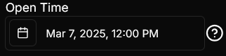
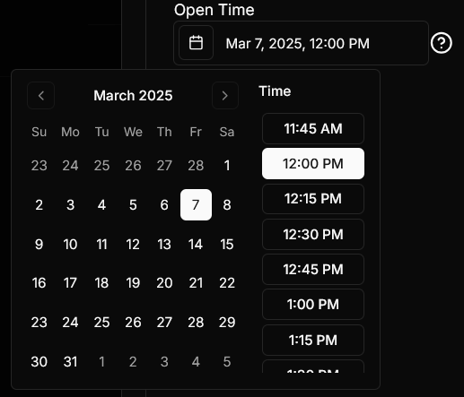

# Date Setting
This is a setting which you can show a date input box.

## Json configuration
`unixTimestamp` is an integer value representing the time, in milliseconds, which the form should be initially.

"Unix time is a date and time representation widely used in computing. It measures time by the number of non-leap seconds that have elapsed since 00:00:00 UTC on 1 January 1970, the Unix epoch." [Unix Time Wikipedia](https://en.wikipedia.org/wiki/Unix_time)


```json
{
  "disabled": false,
  "label": "Open Time",
  "required": true,
  "tooltip": "The date that the quiz will open",
  "type": "Date",
  "unixTimestamp": 1741348800
}
```

## Visual Look
### Date
#### Date Closed

#### Date Opened

