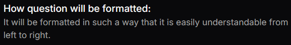

# Description Setting
This is a simple setting where we just have a more indepth description than the tool tip of an item. It is not really a setting and more just text which can be displayed to the user.

## Json configuration
`label` is ignored for description where we instead opt for using the `title`.

`value` is the actual descriptive text.

```json
{
  "type": "Description",
  "title": "How question will be formatted:",
  "label": "How question will be formatted:",
  "tooltip": false,
  "required": true,
  "disabled": false,
  "value": "It will be formatted in such a way that it is easily understandable from left to right."
}
```

## Visual Look
### Description

