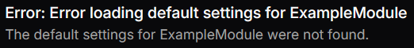

# Error Display Setting
This is a way of displaying an error to the user.

## Disclaimer
This is still in active development so the look may change. However, the JSON to defined it will stay the same.

## Json configuration
`label` is ignored for error where we instead opt for using the `title`.

`value` is the actual error text.

```json
{
  "type": "Error",
  "title": "Error loading default settings for ExampleModule",
  "label": "Error",
  "tooltip": false,
  "required": false,
  "disabled": false,
  "value": "The default settings for ExampleModule were not found."
}
```

## Visual Look
### Error

