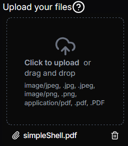

# File Upload Setting
This is a setting which allows for uploading files.

## Disclaimer
**Warning this is still very experimental and communication between the spring boot server and the front end might not act accordingly or be implemented correctly for use.**

## Json configuration

```json
    {
  "type": "File",
  "files": [],
  "fileTypesAllowed": {
    "image/jpeg": [".jpg", ".jpeg"],
    "image/png": [".png"],
    "application/pdf": [".pdf", ".PDF"]
  },
  "maxFileCount": 3,
  "maxCumulativeFileSizeBytes": 10485760,
  "required": true,
  "disabled": false,
  "label": "Upload your files",
  "tooltip": "Supported formats: JPG, PNG, PDF"
}
```

#### FileTypesAllowed
This is implemented from [react dropzone](https://react-dropzone.js.org/#!/Accepting%20specific%20file%20types) and the file types allowed are specified from [mozilla Common MIME types](https://developer.mozilla.org/en-US/docs/Web/HTTP/MIME_types/Common_types).

You can specify a map of the MIME type to the file extensions allowed, leaving an empty array to allow all types of that extension. For example:
```json
{
    "image/jpeg": [],
    "image/png": [".png"],
    "application/pdf": [".pdf", ".PDF"]
}
```
In this example, we would allow all `image/jpeg` types and on top of that, we would only allow the file types of `.png` and pdfs of type `.pdf` and `.PDF`.

#### maxFileCount
This is the max number of files which can be uploaded.

#### maxCumulativeFileSizeBytes
This is the maximum bytes which are allowed from all of the uploaded files combined. 


## Visual Look
### File Upload
