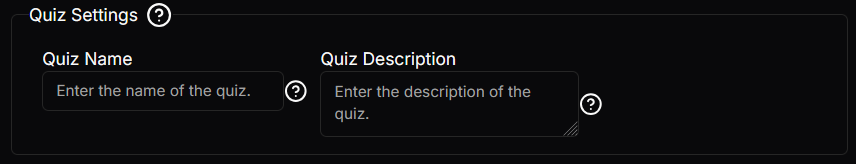

# Group Setting
This is a setting used to group together many settings. This is the composite design pattern where it can contain many children of different settings.

## Json configuration
The `children` array can contain zero to many settings. As long as the settings inherit the `BaseSetting` type it is usable, therefore every setting described in this documentation can be used.

```json
{
  "type": "Group",
  "label": "Quiz Settings",
  "tooltip": "Default settings for the quiz.",
  "required": true,
  "disabled": false,
  "children": [
    {
      "type": "Input",
      "label": "Quiz Name",
      "tooltip": "Enter the name of the quiz.",
      "required": true,
      "disabled": false,
      "value": "",
      "maxCharacters": 100,
      "maxLines": "1"
    },
    {
      "type": "Input",
      "label": "Quiz Description",
      "tooltip": "Enter the description of the quiz.",
      "required": true,
      "disabled": false,
      "value": "",
      "maxCharacters": null,
      "maxLines": null
    }
  ]
}
```

## Visual Look
### Group
