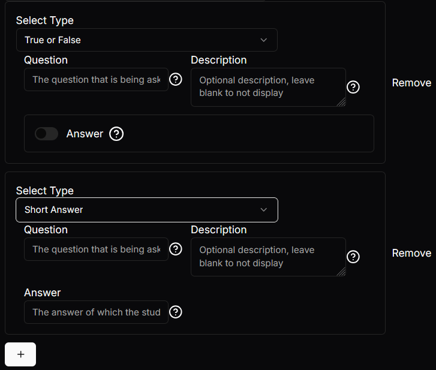

# List Setting
This is similar to the [group setting](group-setting.md), with the major difference being that the list can have a predefined element added on by clicking the plus button. The list can also have elements removed by clicking the remove button.

## Json configuration
The `children` array can contain zero to many settings. As long as the settings inherit the `BaseSetting` type it is usable, therefore every setting described in this documentation can be used. However, remember that every setting that is predefined in `children` can be removed.

The `settingToAdd` can be any setting that inherits the `BaseSetting`, therefore every setting described in this documentation can be used. It is the setting that is added when the plus button is clicked.

You can specify a `true` or `false` value for `allowAddition` and `allowRemoval` to state whether addition of the `settingToAdd` should be allowed from the plus button click. `allowRemoval` specified whether the remove button should work for all elements in children including the ones added by plus button.

`maxAmount` can be `null` or an integer value, where it specifies the maximum amount of children the list can have. If `null` then the list can have infinite children.

`minAmount` can be `null` or an integer value, where it specified the minimum amount of children the list can have. If `null` then the list can remove all the children in it down to an empty list. **- CAUTION: `minAmount` IS STILL A WORK IN PROGRESS SO MAY NOT WORK AS INTENDED**

```json
{
  "type": "ListSetting",
  "tooltip": "Define the website urls allowed to make requests for these questions",
  "label": "Define allowed URLS",
  "required": false,
  "disabled": false,
  "allowAddition": true,
  "allowRemoval": true,
  "maxAmount": null,
  "minAmount": null,
  "children": [],
  "settingToAdd":
  {
    "type": "Input",
    "tooltip": "The website/URL allowed to make the request",
    "label": "Website URL",
    "required": true,
    "disabled": false,
    "value": "",
    "maxCharacters": null,
    "maxLines": "1"
  }

}
```

## Visual Look
### List
This is visual look is for illustration purposes and is not what the example [json configuration](list-setting#json-configuration) described.

