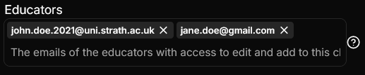

# Tag Input Setting
This is a setting which is very similar to [Multiple Select](./select-setting#multiple-select) however it is visually different and can be used differently depending on the situation.

## Json configuration
The tag input setting can have a list of string `value` defined which are the values shown in the box on first shown.

`maxEntries` can be `null` or an integer value. This is used to limit the number of entries that the user can enter. `null` means infinite entries are allowed.

```json
{
  "type": "TagInput",
  "required": true,
  "disabled": false,
  "label": "Educators",
  "tooltip": "The emails of the educators with access to edit and add to this class",
  "value": [],
  "maxEntries": null
}
```

## Visual Look
### Tag Input

