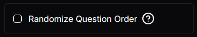
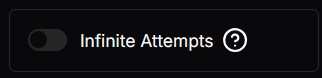

# Toggle Setting
This is a setting which is a boolean configuration.

## Json configuration
Toggle settings allows for a question box which can be a `Checkbox` or a `Switch`.

The `value` can be a `true` or `false`. 

```json
{
      "type": "Toggle",
      "label": "Randomize Question Order",
      "tooltip": "Enable to shuffle the question order for each attempt.",
      "required": false,
      "disabled": false,
      "value": false,
      "display": "Checkbox"
}
```

## Visual Look
### Checkbox

### Switch
